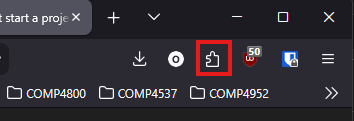
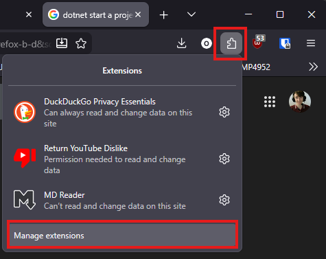
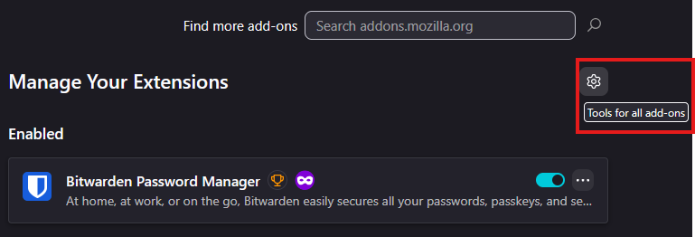
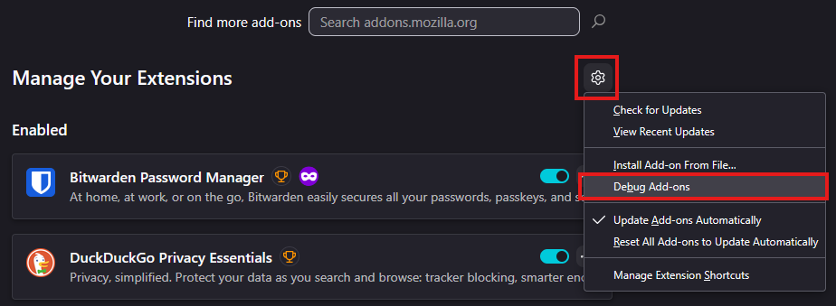
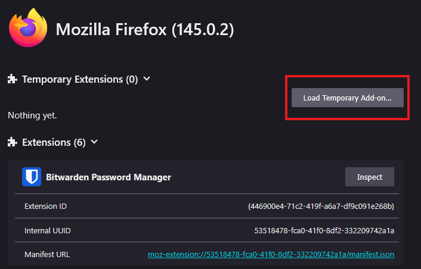

---

# Sockim Extension

Welcome to Sockim, the high-performance instant messaging extension designed specifically for the Firefox browser. Sockim is built on robust ASP.NET technology, delivering quick, reliable communication without forcing you to break your browsing flow.

You can try the application [here](https://sockim.azurewebsites.net)!

See the application repository [here](https://github.com/BetterLordWilliam/COMP4952_Sockim)!

If the extension has been approved by Mozilla, it will be available [here](https://addons.mozilla.org/en-CA/firefox/addon/sockim/)!

# Install the Extension for Development

1. Be sure the change the URL used by the iframe inside of [sockim.html](./popup/sockim.html)

```html
<iframe id="frame"
        src="https://MY-URL"
        sandbox="allow-scripts allow-same-origin allow-popups allow-forms allow-top-navigation"
        allowfullscreen></iframe>
```

2. Open firefox
3. Open the extensions menu



4. Click **Manage Extensions**



5. Click the cog, **Tools for all addons**



6. Click **Debug Add-ons**



7. Click **Load Temporary Add-on**



8. Select the manifest file in the root of this repository in the file picker dialog


9. Click **open**
